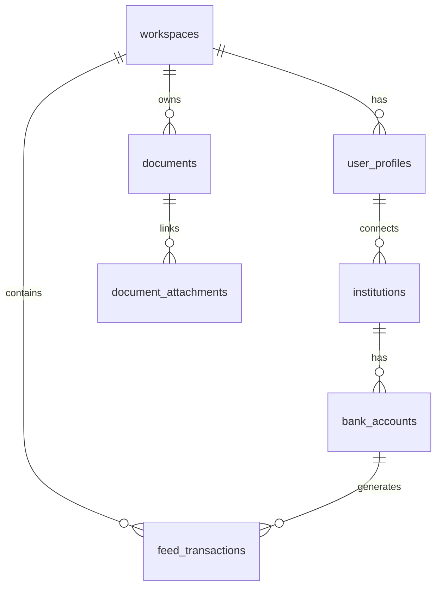

# Clear Piggy Neo 🐷💰

**AI-powered personal finance management with intelligent spending insights**

[](https://clear-piggy-neo.vercel.app)
[](LICENSE)
[](https://www.typescriptlang.org/)
[](https://reactjs.org/)
[](https://supabase.com)

## ✨ Features

### 🤖 AI-Powered Financial Insights
- **Smart Spending Analysis** - Claude AI analyzes your transaction patterns
- **Budget Recommendations** - AI suggests optimal budget allocations
- **Anomaly Detection** - Automatic alerts for unusual spending patterns
- **Personalized Advice** - Actionable recommendations based on your data

### 🏦 Banking Integration
- **Plaid Integration** - Connect 11,000+ financial institutions
- **Real-time Sync** - Automatic transaction updates
- **Multi-Account Support** - Manage checking, savings, credit cards
- **Secure Token Storage** - AES-GCM encryption for sensitive data

### 📊 Advanced Analytics
- **Cash Flow Visualization** - Interactive charts and trends
- **Category Analysis** - Detailed spending breakdowns
- **Merchant Insights** - Logo enrichment and frequency analysis
- **Geographic Patterns** - Location-based spending analysis

### 📄 Receipt Processing
- **OCR Technology** - Extract data from receipt images
- **Smart Matching** - Link receipts to bank transactions
- **Multi-format Support** - Images and PDF processing
- **Metadata Extraction** - Merchant, amounts, dates, line items

### 🎨 Professional UI/UX
- **Dark/Light Themes** - Professional design system
- **Mobile Responsive** - Works on all device sizes
- **Real-time Updates** - Live data synchronization
- **Accessibility** - WCAG compliant interface

## 🚀 Quick Start

### Prerequisites
- Node.js 18+ and npm
- Supabase account
- Plaid developer account
- Anthropic API key (for AI features)

### 1. Clone and Install
```bash
git clone https://github.com/Clear-Piggy/clear-piggy-neo.git
cd clear-piggy-neo
npm install
```

### 2. Environment Setup
Create `.env.local`:
```env
REACT_APP_SUPABASE_URL=your_supabase_url
REACT_APP_SUPABASE_ANON_KEY=your_supabase_anon_key
REACT_APP_PLAID_CLIENT_ID=your_plaid_client_id
REACT_APP_PLAID_SECRET=your_plaid_secret
REACT_APP_PLAID_ENVIRONMENT=sandbox
```

### 3. Database Setup
Run the SQL migrations in your Supabase dashboard:
```sql
-- See /SQL/ directory for complete schema
-- Key tables: workspaces, user_profiles, feed_transactions, documents
```

### 4. Deploy Edge Functions
```bash
# Deploy AI insights function
npx supabase functions deploy ai-spending-insights

# Set Anthropic API key
npx supabase secrets set ANTHROPIC_API_KEY=your_anthropic_key
```

### 5. Start Development Server
```bash
npm start
# Open http://localhost:3000
```

## 🏗️ Architecture

### Frontend Stack
- **React 18** with TypeScript
- **Tailwind CSS** for styling
- **Framer Motion** for animations
- **Recharts** for data visualization
- **Radix UI** for accessible components

### Backend Infrastructure
- **Supabase** - PostgreSQL database with real-time subscriptions
- **Edge Functions** - Serverless API endpoints in Deno
- **Row Level Security** - Multi-tenant data isolation
- **Supabase Storage** - File uploads and receipt storage

### External Services
- **Plaid API** - Bank account connections and transactions
- **Anthropic Claude** - AI-powered financial analysis
- **n8n** - Receipt processing workflow automation

## 📊 Database Schema



## 🔐 Security Features

- **AES-GCM Encryption** for sensitive tokens
- **Row Level Security** policies for data isolation
- **Multi-tenant Architecture** with workspace separation
- **Secure Edge Functions** with authentication validation
- **HTTPS-only** communication
- **No client-side secrets** exposure

## 🤖 AI Insights System

### How It Works
1. **Data Collection** - Analyzes 90 days of transaction history
2. **Pattern Recognition** - Identifies spending patterns and anomalies
3. **Intelligent Analysis** - Claude AI processes transaction data
4. **Actionable Insights** - Provides specific recommendations

### Sample AI Insights
- "Coffee spending up 23% ($127 vs $103 last month)"
- "Switch to generic groceries to save ~$89/month"
- "Unusual $500 charge at Best Buy detected"
- "Consider boosting savings - income increased 12%"

## 📱 Screenshots

### Dashboard Overview


### AI Insights


### Receipt Processing


## 📁 Project Structure

```
clear-piggy-neo/
├── src/
│   ├── components/          # React components
│   │   ├── AIInsightsDashboard.tsx
│   │   ├── Dashboard.tsx
│   │   ├── ReceiptPreview.tsx
│   │   └── ...
│   ├── hooks/              # Custom React hooks
│   ├── contexts/           # React contexts
│   └── lib/               # Utilities and configs
├── supabase/
│   └── functions/         # Edge functions
│       ├── ai-spending-insights/
│       └── workspace-sync-transactions/
├── SQL/                   # Database migrations
├── md/                    # Documentation
└── test-app/             # Testing utilities
```

## 🚀 Deployment

### Vercel (Recommended)
```bash
# Connect to Vercel
npx vercel

# Set environment variables in Vercel dashboard
# Deploy edge functions to Supabase
```

### Manual Deployment
1. Build the app: `npm run build`
2. Deploy `build/` directory to your hosting platform
3. Configure environment variables
4. Deploy Supabase edge functions

## 🧪 Testing

```bash
# Run React tests
npm test

# Validate database schema
node validate-schema.js

# Check AI data quality
node validate-ai-data.js <workspace-id>

# Test Supabase connection
node test-supabase-connection.js
```

## 📈 Performance

- **Caching Strategy** - 4-hour AI insights cache
- **Optimized Queries** - Indexed database operations
- **Lazy Loading** - Component-based code splitting
- **Real-time Updates** - Efficient WebSocket connections
- **Cost Optimization** - ~$0.10-$0.30 per user/month

## 🤝 Contributing

1. Fork the repository
2. Create a feature branch: `git checkout -b feature/amazing-feature`
3. Commit changes: `git commit -m 'Add amazing feature'`
4. Push to branch: `git push origin feature/amazing-feature`
5. Open a Pull Request

## 📋 Development Roadmap

- [ ] Mobile app (React Native)
- [ ] Advanced budgeting tools
- [ ] Investment tracking
- [ ] Multi-currency support
- [ ] Export functionality (CSV/PDF)
- [ ] Recurring transaction detection
- [ ] Bill reminders and alerts

## 📄 License

This project is licensed under the MIT License - see the [LICENSE](LICENSE) file for details.

## 🙏 Acknowledgments

- **Anthropic Claude** - AI-powered financial analysis
- **Plaid** - Banking data connectivity
- **Supabase** - Backend infrastructure
- **Tailwind CSS** - Utility-first CSS framework
- **React Team** - Component-based UI framework

## 📞 Support

- 📧 Email: support@clearpiggy.com
- 💬 Discord: [Join our community](https://discord.gg/clearpiggy)
- 📖 Docs: [Full documentation](https://docs.clearpiggy.com)
- 🐛 Issues: [GitHub Issues](https://github.com/Clear-Piggy/clear-piggy-neo/issues)

---

**Built with ❤️ by the Clear Piggy team**

🤖 *This README was generated with assistance from [Claude Code](https://claude.ai/code)*