# Database Schema Documentation

Generated: 2025-09-03T00:35:15.257Z

## Table of Contents

1. [Overview](#overview)
2. [Tables](#tables)
3. [Relationships](#relationships)
4. [Indexes](#indexes)
5. [Views](#views)
6. [Functions](#functions)

## Overview

Total Tables: 28

| Table | Description |
|-------|-------------|
| [audit_events](#audit_events) | No description |
| [bank_accounts](#bank_accounts) | No description |
| [budget_lines](#budget_lines) | No description |
| [budgets](#budgets) | No description |
| [categories](#categories) | No description |
| [category_rules](#category_rules) | No description |
| [chart_of_accounts](#chart_of_accounts) | No description |
| [classes](#classes) | No description |
| [document_attachments](#document_attachments) | No description |
| [documents](#documents) | No description |
| [feed_transactions](#feed_transactions) | No description |
| [forecasts](#forecasts) | No description |
| [institutions](#institutions) | No description |
| [journal_batches](#journal_batches) | No description |
| [ledger_entries](#ledger_entries) | No description |
| [locations](#locations) | No description |
| [merchant_aliases](#merchant_aliases) | No description |
| [notes](#notes) | No description |
| [plaid_enrichment_data](#plaid_enrichment_data) | No description |
| [projects](#projects) | No description |
| [rule_applications](#rule_applications) | No description |
| [tasks](#tasks) | No description |
| [transaction_links](#transaction_links) | No description |
| [user_profiles](#user_profiles) | No description |
| [webhook_events](#webhook_events) | No description |
| [webhook_processing_log](#webhook_processing_log) | No description |
| [workspace_members](#workspace_members) | No description |
| [workspaces](#workspaces) | No description |

## Tables

### audit_events

#### Columns

| Column | Type | Nullable | Default | Description |
|--------|------|----------|---------|-------------|
| id | uuid | NO | gen_random_uuid() |  |
| workspace_id | uuid | NO | NULL |  |
| event_type | text | NO | NULL |  |
| event_action | text | NO | NULL |  |
| table_name | text | NO | NULL |  |
| record_id | uuid | NO | NULL |  |
| old_values | jsonb | YES | NULL |  |
| new_values | jsonb | YES | NULL |  |
| metadata | jsonb | NO | '{}'::jsonb |  |
| occurred_at | timestamp with time zone | NO | now() |  |
| user_id | uuid | YES | NULL |  |
| ip_address | inet | YES | NULL |  |
| user_agent | text | YES | NULL |  |

#### Constraints

| Name | Type | Columns | Foreign Table | Foreign Columns |
|------|------|---------|---------------|----------------|
| audit_events_user_id_fkey | FOREIGN KEY | user_id | user_profiles | id |
| audit_events_workspace_id_fkey | FOREIGN KEY | workspace_id | workspaces | id |
| audit_events_pkey | PRIMARY KEY | id | audit_events | id |

#### Indexes

| Index Name | Definition |
|------------|------------|
| audit_events_pkey | `CREATE UNIQUE INDEX audit_events_pkey ON public.audit_events USING btree (id)` |
| idx_audit_events_occurred_at | `CREATE INDEX idx_audit_events_occurred_at ON public.audit_events USING btree (occurred_at DESC)` |
| idx_audit_events_table_record | `CREATE INDEX idx_audit_events_table_record ON public.audit_events USING btree (table_name, record_id)` |
| idx_audit_events_user_id | `CREATE INDEX idx_audit_events_user_id ON public.audit_events USING btree (user_id) WHERE (user_id IS NOT NULL)` |
| idx_audit_events_workspace_id | `CREATE INDEX idx_audit_events_workspace_id ON public.audit_events USING btree (workspace_id)` |

### bank_accounts

#### Columns

| Column | Type | Nullable | Default | Description |
|--------|------|----------|---------|-------------|
| id | uuid | NO | gen_random_uuid() |  |
| workspace_id | uuid | NO | NULL |  |
| institution_id | uuid | NO | NULL |  |
| plaid_account_id | text | YES | NULL |  |
| account_type | USER-DEFINED | NO | NULL |  |
| account_subtype | text | YES | NULL |  |
| name | text | NO | NULL |  |
| official_name | text | YES | NULL |  |
| mask | text | YES | NULL |  |
| current_balance_cents | bigint | YES | NULL |  |
| available_balance_cents | bigint | YES | NULL |  |
| credit_limit_cents | bigint | YES | NULL |  |
| currency_code | character(3) | NO | 'USD'::bpchar |  |
| is_active | boolean | NO | true |  |
| is_business | boolean | NO | false |  |
| last_sync_at | timestamp with time zone | YES | NULL |  |
| sync_cursor | text | YES | NULL |  |
| metadata | jsonb | NO | '{}'::jsonb |  |
| deleted_at | timestamp with time zone | YES | NULL |  |
| created_at | timestamp with time zone | NO | now() |  |
| updated_at | timestamp with time zone | NO | now() |  |
| created_by | uuid | NO | NULL |  |
| updated_by | uuid | NO | NULL |  |
| plaid_account_data | jsonb | YES | '{}'::jsonb |  |
| account_subtype_detailed | text | YES | NULL |  |
| verification_status | text | YES | NULL |  |
| persistent_account_id | text | YES | NULL |  |
| routing_number | text | YES | NULL |  |
| wire_routing_number | text | YES | NULL |  |
| account_number_encrypted | text | YES | NULL |  |
| sort_code | text | YES | NULL |  |
| iban | text | YES | NULL |  |
| bic | text | YES | NULL |  |
| balance_limit_cents | bigint | YES | NULL |  |
| balance_limit_type | text | YES | NULL |  |
| balance_iso_currency_code | character(3) | YES | NULL |  |
| balance_unofficial_currency_code | text | YES | NULL |  |
| balance_last_updated_datetime | timestamp with time zone | YES | NULL |  |

#### Constraints

| Name | Type | Columns | Foreign Table | Foreign Columns |
|------|------|---------|---------------|----------------|
| bank_accounts_created_by_fkey | FOREIGN KEY | created_by | user_profiles | id |
| bank_accounts_institution_id_fkey | FOREIGN KEY | institution_id | institutions | id |
| bank_accounts_updated_by_fkey | FOREIGN KEY | updated_by | user_profiles | id |
| bank_accounts_workspace_id_fkey | FOREIGN KEY | workspace_id | workspaces | id |
| bank_accounts_pkey | PRIMARY KEY | id | bank_accounts | id |

#### Indexes

| Index Name | Definition |
|------------|------------|
| bank_accounts_pkey | `CREATE UNIQUE INDEX bank_accounts_pkey ON public.bank_accounts USING btree (id)` |
| idx_bank_accounts_active | `CREATE INDEX idx_bank_accounts_active ON public.bank_accounts USING btree (workspace_id) WHERE ((deleted_at IS NULL) AND (is_active = true))` |
| idx_bank_accounts_institution_id | `CREATE INDEX idx_bank_accounts_institution_id ON public.bank_accounts USING btree (institution_id)` |
| idx_bank_accounts_persistent_id | `CREATE INDEX idx_bank_accounts_persistent_id ON public.bank_accounts USING btree (persistent_account_id)` |
| idx_bank_accounts_plaid_id | `CREATE INDEX idx_bank_accounts_plaid_id ON public.bank_accounts USING btree (plaid_account_id)` |
| idx_bank_accounts_routing_number | `CREATE INDEX idx_bank_accounts_routing_number ON public.bank_accounts USING btree (routing_number)` |
| idx_bank_accounts_workspace_id | `CREATE INDEX idx_bank_accounts_workspace_id ON public.bank_accounts USING btree (workspace_id)` |

### budget_lines

#### Columns

| Column | Type | Nullable | Default | Description |
|--------|------|----------|---------|-------------|
| id | uuid | NO | gen_random_uuid() |  |
| workspace_id | uuid | NO | NULL |  |
| budget_id | uuid | NO | NULL |  |
| category_id | uuid | YES | NULL |  |
| account_id | uuid | YES | NULL |  |
| class_id | uuid | YES | NULL |  |
| project_id | uuid | YES | NULL |  |
| line_name | text | NO | NULL |  |
| budgeted_amount_cents | bigint | NO | NULL |  |
| currency_code | character(3) | NO | 'USD'::bpchar |  |
| notes | text | YES | NULL |  |
| metadata | jsonb | NO | '{}'::jsonb |  |
| created_at | timestamp with time zone | NO | now() |  |
| updated_at | timestamp with time zone | NO | now() |  |
| created_by | uuid | NO | NULL |  |
| updated_by | uuid | NO | NULL |  |

#### Constraints

| Name | Type | Columns | Foreign Table | Foreign Columns |
|------|------|---------|---------------|----------------|
| budget_lines_account_id_fkey | FOREIGN KEY | account_id | chart_of_accounts | id |
| budget_lines_budget_id_fkey | FOREIGN KEY | budget_id | budgets | id |
| budget_lines_category_id_fkey | FOREIGN KEY | category_id | categories | id |
| budget_lines_class_id_fkey | FOREIGN KEY | class_id | classes | id |
| budget_lines_created_by_fkey | FOREIGN KEY | created_by | user_profiles | id |
| budget_lines_project_id_fkey | FOREIGN KEY | project_id | projects | id |
| budget_lines_updated_by_fkey | FOREIGN KEY | updated_by | user_profiles | id |
| budget_lines_workspace_id_fkey | FOREIGN KEY | workspace_id | workspaces | id |
| budget_lines_pkey | PRIMARY KEY | id | budget_lines | id |

#### Indexes

| Index Name | Definition |
|------------|------------|
| budget_lines_pkey | `CREATE UNIQUE INDEX budget_lines_pkey ON public.budget_lines USING btree (id)` |
| idx_budget_lines_budget_id | `CREATE INDEX idx_budget_lines_budget_id ON public.budget_lines USING btree (budget_id)` |
| idx_budget_lines_category_id | `CREATE INDEX idx_budget_lines_category_id ON public.budget_lines USING btree (category_id)` |
| idx_budget_lines_workspace_id | `CREATE INDEX idx_budget_lines_workspace_id ON public.budget_lines USING btree (workspace_id)` |

### budgets

#### Columns

| Column | Type | Nullable | Default | Description |
|--------|------|----------|---------|-------------|
| id | uuid | NO | gen_random_uuid() |  |
| workspace_id | uuid | NO | NULL |  |
| name | text | NO | NULL |  |
| description | text | YES | NULL |  |
| period_type | USER-DEFINED | NO | 'monthly'::period_type_enum |  |
| start_date | date | NO | NULL |  |
| end_date | date | NO | NULL |  |
| currency_code | character(3) | NO | 'USD'::bpchar |  |
| is_active | boolean | NO | true |  |
| is_template | boolean | NO | false |  |
| total_budgeted_cents | bigint | NO | 0 |  |
| metadata | jsonb | NO | '{}'::jsonb |  |
| deleted_at | timestamp with time zone | YES | NULL |  |
| created_at | timestamp with time zone | NO | now() |  |
| updated_at | timestamp with time zone | NO | now() |  |
| created_by | uuid | NO | NULL |  |
| updated_by | uuid | NO | NULL |  |

#### Constraints

| Name | Type | Columns | Foreign Table | Foreign Columns |
|------|------|---------|---------------|----------------|
| budgets_created_by_fkey | FOREIGN KEY | created_by | user_profiles | id |
| budgets_updated_by_fkey | FOREIGN KEY | updated_by | user_profiles | id |
| budgets_workspace_id_fkey | FOREIGN KEY | workspace_id | workspaces | id |
| budgets_pkey | PRIMARY KEY | id | budgets | id |
| budgets_workspace_id_name_start_date_key | UNIQUE | workspace_id, workspace_id, workspace_id, name, name, name, start_date, start_date, start_date | budgets | name, workspace_id, start_date, workspace_id, name, start_date, name, workspace_id, start_date |

#### Indexes

| Index Name | Definition |
|------------|------------|
| budgets_pkey | `CREATE UNIQUE INDEX budgets_pkey ON public.budgets USING btree (id)` |
| budgets_workspace_id_name_start_date_key | `CREATE UNIQUE INDEX budgets_workspace_id_name_start_date_key ON public.budgets USING btree (workspace_id, name, start_date)` |
| idx_budgets_active | `CREATE INDEX idx_budgets_active ON public.budgets USING btree (workspace_id) WHERE ((is_active = true) AND (deleted_at IS NULL))` |
| idx_budgets_period | `CREATE INDEX idx_budgets_period ON public.budgets USING btree (workspace_id, start_date, end_date)` |
| idx_budgets_workspace_id | `CREATE INDEX idx_budgets_workspace_id ON public.budgets USING btree (workspace_id)` |

### categories

#### Columns

| Column | Type | Nullable | Default | Description |
|--------|------|----------|---------|-------------|
| id | uuid | NO | gen_random_uuid() |  |
| workspace_id | uuid | NO | NULL |  |
| name | text | NO | NULL |  |
| description | text | YES | NULL |  |
| category_type | text | NO | 'expense'::text |  |
| parent_category_id | uuid | YES | NULL |  |
| default_account_id | uuid | YES | NULL |  |
| color | text | YES | NULL |  |
| icon | text | YES | NULL |  |
| is_active | boolean | NO | true |  |
| is_system | boolean | NO | false |  |
| sort_order | integer | NO | 0 |  |
| metadata | jsonb | NO | '{}'::jsonb |  |
| deleted_at | timestamp with time zone | YES | NULL |  |
| created_at | timestamp with time zone | NO | now() |  |
| updated_at | timestamp with time zone | NO | now() |  |
| created_by | uuid | NO | NULL |  |
| updated_by | uuid | NO | NULL |  |

#### Constraints

| Name | Type | Columns | Foreign Table | Foreign Columns |
|------|------|---------|---------------|----------------|
| categories_created_by_fkey | FOREIGN KEY | created_by | user_profiles | id |
| categories_default_account_id_fkey | FOREIGN KEY | default_account_id | chart_of_accounts | id |
| categories_parent_category_id_fkey | FOREIGN KEY | parent_category_id | categories | id |
| categories_updated_by_fkey | FOREIGN KEY | updated_by | user_profiles | id |
| categories_workspace_id_fkey | FOREIGN KEY | workspace_id | workspaces | id |
| categories_pkey | PRIMARY KEY | id | categories | id |
| categories_workspace_id_name_key | UNIQUE | workspace_id, workspace_id, name, name | categories | name, workspace_id, name, workspace_id |

#### Indexes

| Index Name | Definition |
|------------|------------|
| categories_pkey | `CREATE UNIQUE INDEX categories_pkey ON public.categories USING btree (id)` |
| categories_workspace_id_name_key | `CREATE UNIQUE INDEX categories_workspace_id_name_key ON public.categories USING btree (workspace_id, name)` |
| idx_categories_active | `CREATE INDEX idx_categories_active ON public.categories USING btree (workspace_id) WHERE ((is_active = true) AND (deleted_at IS NULL))` |
| idx_categories_parent_id | `CREATE INDEX idx_categories_parent_id ON public.categories USING btree (parent_category_id)` |
| idx_categories_workspace_id | `CREATE INDEX idx_categories_workspace_id ON public.categories USING btree (workspace_id)` |

### category_rules

#### Columns

| Column | Type | Nullable | Default | Description |
|--------|------|----------|---------|-------------|
| id | uuid | NO | gen_random_uuid() |  |
| workspace_id | uuid | NO | NULL |  |
| name | text | NO | NULL |  |
| description | text | YES | NULL |  |
| condition_type | USER-DEFINED | NO | NULL |  |
| condition_value | text | NO | NULL |  |
| condition_operator | text | NO | 'equals'::text |  |
| action_type | USER-DEFINED | NO | NULL |  |
| category_id | uuid | YES | NULL |  |
| account_id | uuid | YES | NULL |  |
| merchant_alias_id | uuid | YES | NULL |  |
| split_allocations | jsonb | YES | NULL |  |
| priority | integer | NO | 100 |  |
| is_active | boolean | NO | true |  |
| confidence_score | numeric | NO | 1.00 |  |
| active_from | date | NO | CURRENT_DATE |  |
| active_to | date | YES | NULL |  |
| metadata | jsonb | NO | '{}'::jsonb |  |
| created_at | timestamp with time zone | NO | now() |  |
| updated_at | timestamp with time zone | NO | now() |  |
| created_by | uuid | NO | NULL |  |
| updated_by | uuid | NO | NULL |  |

#### Constraints

| Name | Type | Columns | Foreign Table | Foreign Columns |
|------|------|---------|---------------|----------------|
| category_rules_account_id_fkey | FOREIGN KEY | account_id | chart_of_accounts | id |
| category_rules_category_id_fkey | FOREIGN KEY | category_id | categories | id |
| category_rules_created_by_fkey | FOREIGN KEY | created_by | user_profiles | id |
| category_rules_merchant_alias_id_fkey | FOREIGN KEY | merchant_alias_id | merchant_aliases | id |
| category_rules_updated_by_fkey | FOREIGN KEY | updated_by | user_profiles | id |
| category_rules_workspace_id_fkey | FOREIGN KEY | workspace_id | workspaces | id |
| category_rules_pkey | PRIMARY KEY | id | category_rules | id |

#### Indexes

| Index Name | Definition |
|------------|------------|
| category_rules_pkey | `CREATE UNIQUE INDEX category_rules_pkey ON public.category_rules USING btree (id)` |
| idx_category_rules_active | `CREATE INDEX idx_category_rules_active ON public.category_rules USING btree (workspace_id) WHERE (is_active = true)` |
| idx_category_rules_priority | `CREATE INDEX idx_category_rules_priority ON public.category_rules USING btree (workspace_id, priority DESC) WHERE (is_active = true)` |
| idx_category_rules_workspace_id | `CREATE INDEX idx_category_rules_workspace_id ON public.category_rules USING btree (workspace_id)` |

### chart_of_accounts

#### Columns

| Column | Type | Nullable | Default | Description |
|--------|------|----------|---------|-------------|
| id | uuid | NO | gen_random_uuid() |  |
| workspace_id | uuid | NO | NULL |  |
| account_code | text | NO | NULL |  |
| account_name | text | NO | NULL |  |
| account_type | USER-DEFINED | NO | NULL |  |
| account_subtype | text | YES | NULL |  |
| parent_account_id | uuid | YES | NULL |  |
| level | integer | NO | 1 |  |
| is_active | boolean | NO | true |  |
| is_system | boolean | NO | false |  |
| normal_balance | USER-DEFINED | NO | NULL |  |
| tax_line_mapping | text | YES | NULL |  |
| description | text | YES | NULL |  |
| metadata | jsonb | NO | '{}'::jsonb |  |
| deleted_at | timestamp with time zone | YES | NULL |  |
| created_at | timestamp with time zone | NO | now() |  |
| updated_at | timestamp with time zone | NO | now() |  |
| created_by | uuid | NO | NULL |  |
| updated_by | uuid | NO | NULL |  |

#### Constraints

| Name | Type | Columns | Foreign Table | Foreign Columns |
|------|------|---------|---------------|----------------|
| chart_of_accounts_created_by_fkey | FOREIGN KEY | created_by | user_profiles | id |
| chart_of_accounts_parent_account_id_fkey | FOREIGN KEY | parent_account_id | chart_of_accounts | id |
| chart_of_accounts_updated_by_fkey | FOREIGN KEY | updated_by | user_profiles | id |
| chart_of_accounts_workspace_id_fkey | FOREIGN KEY | workspace_id | workspaces | id |
| chart_of_accounts_pkey | PRIMARY KEY | id | chart_of_accounts | id |
| chart_of_accounts_workspace_id_account_code_key | UNIQUE | workspace_id, workspace_id, account_code, account_code | chart_of_accounts | account_code, workspace_id, account_code, workspace_id |

#### Indexes

| Index Name | Definition |
|------------|------------|
| chart_of_accounts_pkey | `CREATE UNIQUE INDEX chart_of_accounts_pkey ON public.chart_of_accounts USING btree (id)` |
| chart_of_accounts_workspace_id_account_code_key | `CREATE UNIQUE INDEX chart_of_accounts_workspace_id_account_code_key ON public.chart_of_accounts USING btree (workspace_id, account_code)` |
| idx_coa_active | `CREATE INDEX idx_coa_active ON public.chart_of_accounts USING btree (workspace_id) WHERE ((is_active = true) AND (deleted_at IS NULL))` |
| idx_coa_parent_id | `CREATE INDEX idx_coa_parent_id ON public.chart_of_accounts USING btree (parent_account_id)` |
| idx_coa_workspace_id | `CREATE INDEX idx_coa_workspace_id ON public.chart_of_accounts USING btree (workspace_id)` |

### classes

#### Columns

| Column | Type | Nullable | Default | Description |
|--------|------|----------|---------|-------------|
| id | uuid | NO | gen_random_uuid() |  |
| workspace_id | uuid | NO | NULL |  |
| name | text | NO | NULL |  |
| description | text | YES | NULL |  |
| class_code | text | YES | NULL |  |
| parent_class_id | uuid | YES | NULL |  |
| is_active | boolean | NO | true |  |
| metadata | jsonb | NO | '{}'::jsonb |  |
| deleted_at | timestamp with time zone | YES | NULL |  |
| created_at | timestamp with time zone | NO | now() |  |
| updated_at | timestamp with time zone | NO | now() |  |
| created_by | uuid | NO | NULL |  |
| updated_by | uuid | NO | NULL |  |

#### Constraints

| Name | Type | Columns | Foreign Table | Foreign Columns |
|------|------|---------|---------------|----------------|
| classes_created_by_fkey | FOREIGN KEY | created_by | user_profiles | id |
| classes_parent_class_id_fkey | FOREIGN KEY | parent_class_id | classes | id |
| classes_updated_by_fkey | FOREIGN KEY | updated_by | user_profiles | id |
| classes_workspace_id_fkey | FOREIGN KEY | workspace_id | workspaces | id |
| classes_pkey | PRIMARY KEY | id | classes | id |
| classes_workspace_id_name_key | UNIQUE | workspace_id, workspace_id, name, name | classes | name, workspace_id, name, workspace_id |

#### Indexes

| Index Name | Definition |
|------------|------------|
| classes_pkey | `CREATE UNIQUE INDEX classes_pkey ON public.classes USING btree (id)` |
| classes_workspace_id_name_key | `CREATE UNIQUE INDEX classes_workspace_id_name_key ON public.classes USING btree (workspace_id, name)` |

### document_attachments

#### Columns

| Column | Type | Nullable | Default | Description |
|--------|------|----------|---------|-------------|
| id | uuid | NO | gen_random_uuid() |  |
| workspace_id | uuid | NO | NULL |  |
| document_id | uuid | NO | NULL |  |
| attached_to_type | text | NO | NULL |  |
| attached_to_id | uuid | NO | NULL |  |
| attachment_type | text | NO | 'support'::text |  |
| notes | text | YES | NULL |  |
| created_at | timestamp with time zone | NO | now() |  |
| created_by | uuid | NO | NULL |  |

#### Constraints

| Name | Type | Columns | Foreign Table | Foreign Columns |
|------|------|---------|---------------|----------------|
| document_attachments_created_by_fkey | FOREIGN KEY | created_by | user_profiles | id |
| document_attachments_document_id_fkey | FOREIGN KEY | document_id | documents | id |
| document_attachments_workspace_id_fkey | FOREIGN KEY | workspace_id | workspaces | id |
| document_attachments_pkey | PRIMARY KEY | id | document_attachments | id |
| document_attachments_document_id_attached_to_type_attached__key | UNIQUE | document_id, document_id, document_id, attached_to_type, attached_to_type, attached_to_type, attached_to_id, attached_to_id, attached_to_id | document_attachments | document_id, attached_to_type, attached_to_id, attached_to_id, attached_to_type, document_id, attached_to_id, attached_to_type, document_id |

#### Indexes

| Index Name | Definition |
|------------|------------|
| document_attachments_document_id_attached_to_type_attached__key | `CREATE UNIQUE INDEX document_attachments_document_id_attached_to_type_attached__key ON public.document_attachments USING btree (document_id, attached_to_type, attached_to_id)` |
| document_attachments_pkey | `CREATE UNIQUE INDEX document_attachments_pkey ON public.document_attachments USING btree (id)` |
| idx_document_attachments_attached_to | `CREATE INDEX idx_document_attachments_attached_to ON public.document_attachments USING btree (attached_to_type, attached_to_id)` |
| idx_document_attachments_document_id | `CREATE INDEX idx_document_attachments_document_id ON public.document_attachments USING btree (document_id)` |
| idx_document_attachments_workspace_id | `CREATE INDEX idx_document_attachments_workspace_id ON public.document_attachments USING btree (workspace_id)` |

### documents

#### Columns

| Column | Type | Nullable | Default | Description |
|--------|------|----------|---------|-------------|
| id | uuid | NO | gen_random_uuid() |  |
| workspace_id | uuid | NO | NULL |  |
| filename | text | NO | NULL |  |
| file_size | bigint | NO | NULL |  |
| mime_type | text | NO | NULL |  |
| document_type | USER-DEFINED | NO | 'receipt'::document_type_enum |  |
| storage_path | text | NO | NULL |  |
| storage_bucket | text | NO | 'documents'::text |  |
| sha256_hash | text | NO | NULL |  |
| ocr_text | text | YES | NULL |  |
| ocr_confidence | numeric | YES | NULL |  |
| ocr_metadata | jsonb | YES | NULL |  |
| processing_status | USER-DEFINED | NO | 'uploaded'::document_status_enum |  |
| processed_at | timestamp with time zone | YES | NULL |  |
| error_message | text | YES | NULL |  |
| metadata | jsonb | NO | '{}'::jsonb |  |
| deleted_at | timestamp with time zone | YES | NULL |  |
| created_at | timestamp with time zone | NO | now() |  |
| updated_at | timestamp with time zone | NO | now() |  |
| created_by | uuid | NO | NULL |  |
| updated_by | uuid | NO | NULL |  |

#### Constraints

| Name | Type | Columns | Foreign Table | Foreign Columns |
|------|------|---------|---------------|----------------|
| documents_created_by_fkey | FOREIGN KEY | created_by | user_profiles | id |
| documents_updated_by_fkey | FOREIGN KEY | updated_by | user_profiles | id |
| documents_workspace_id_fkey | FOREIGN KEY | workspace_id | workspaces | id |
| documents_pkey | PRIMARY KEY | id | documents | id |

#### Indexes

| Index Name | Definition |
|------------|------------|
| documents_pkey | `CREATE UNIQUE INDEX documents_pkey ON public.documents USING btree (id)` |
| idx_documents_hash | `CREATE INDEX idx_documents_hash ON public.documents USING btree (sha256_hash)` |
| idx_documents_status | `CREATE INDEX idx_documents_status ON public.documents USING btree (workspace_id, processing_status)` |
| idx_documents_workspace_id | `CREATE INDEX idx_documents_workspace_id ON public.documents USING btree (workspace_id)` |

### feed_transactions

#### Columns

| Column | Type | Nullable | Default | Description |
|--------|------|----------|---------|-------------|
| id | uuid | NO | gen_random_uuid() |  |
| workspace_id | uuid | NO | NULL |  |
| bank_account_id | uuid | NO | NULL |  |
| plaid_transaction_id | text | YES | NULL |  |
| provider_unique_id | text | NO | NULL |  |
| content_hash | text | NO | NULL |  |
| amount_cents | bigint | NO | NULL |  |
| currency_code | character(3) | NO | 'USD'::bpchar |  |
| direction | USER-DEFINED | NO | NULL |  |
| status | USER-DEFINED | NO | 'posted'::transaction_status_enum |  |
| transaction_date | date | NO | NULL |  |
| authorized_date | date | YES | NULL |  |
| merchant_name | text | YES | NULL |  |
| merchant_normalized | text | YES | NULL |  |
| description | text | YES | NULL |  |
| reference_number | text | YES | NULL |  |
| category_primary | text | YES | NULL |  |
| category_detailed | text | YES | NULL |  |
| location_data | jsonb | YES | NULL |  |
| payment_meta | jsonb | YES | NULL |  |
| plaid_enriched | jsonb | YES | NULL |  |
| categorization_confidence | numeric | YES | NULL |  |
| is_split | boolean | NO | false |  |
| parent_transaction_id | uuid | YES | NULL |  |
| reconciliation_status | USER-DEFINED | NO | 'unreconciled'::reconciliation_status_enum |  |
| reconciled_at | timestamp with time zone | YES | NULL |  |
| reconciled_by | uuid | YES | NULL |  |
| imported_at | timestamp with time zone | NO | now() |  |
| raw_data | jsonb | YES | NULL |  |
| deleted_at | timestamp with time zone | YES | NULL |  |
| created_at | timestamp with time zone | NO | now() |  |
| updated_at | timestamp with time zone | NO | now() |  |
| created_by | uuid | NO | NULL |  |
| updated_by | uuid | NO | NULL |  |
| merchant_logo_url | text | YES | NULL |  |
| merchant_website | text | YES | NULL |  |
| merchant_entity_id | text | YES | NULL |  |
| counterparty_name | text | YES | NULL |  |
| counterparty_type | text | YES | NULL |  |
| counterparty_logo_url | text | YES | NULL |  |
| counterparty_website | text | YES | NULL |  |
| counterparty_entity_id | text | YES | NULL |  |
| location_address | text | YES | NULL |  |
| location_city | text | YES | NULL |  |
| location_region | text | YES | NULL |  |
| location_postal_code | text | YES | NULL |  |
| location_country | text | YES | NULL |  |
| location_lat | numeric | YES | NULL |  |
| location_lon | numeric | YES | NULL |  |
| location_store_number | text | YES | NULL |  |
| payment_method | text | YES | NULL |  |
| payment_processor | text | YES | NULL |  |
| payment_reference_number | text | YES | NULL |  |
| payment_reason | text | YES | NULL |  |
| payment_ppd_id | text | YES | NULL |  |
| payment_payee | text | YES | NULL |  |
| payment_payer | text | YES | NULL |  |
| personal_finance_category_primary | text | YES | NULL |  |
| personal_finance_category_detailed | text | YES | NULL |  |
| personal_finance_category_confidence | numeric | YES | NULL |  |
| website | text | YES | NULL |  |
| check_number | text | YES | NULL |  |
| transaction_code | text | YES | NULL |  |

#### Constraints

| Name | Type | Columns | Foreign Table | Foreign Columns |
|------|------|---------|---------------|----------------|
| feed_transactions_bank_account_id_fkey | FOREIGN KEY | bank_account_id | bank_accounts | id |
| feed_transactions_created_by_fkey | FOREIGN KEY | created_by | user_profiles | id |
| feed_transactions_parent_transaction_id_fkey | FOREIGN KEY | parent_transaction_id | feed_transactions | id |
| feed_transactions_reconciled_by_fkey | FOREIGN KEY | reconciled_by | user_profiles | id |
| feed_transactions_updated_by_fkey | FOREIGN KEY | updated_by | user_profiles | id |
| feed_transactions_workspace_id_fkey | FOREIGN KEY | workspace_id | workspaces | id |
| feed_transactions_pkey | PRIMARY KEY | id | feed_transactions | id |
| feed_transactions_provider_unique_id_key | UNIQUE | provider_unique_id | feed_transactions | provider_unique_id |

#### Indexes

| Index Name | Definition |
|------------|------------|
| feed_transactions_pkey | `CREATE UNIQUE INDEX feed_transactions_pkey ON public.feed_transactions USING btree (id)` |
| feed_transactions_provider_unique_id_key | `CREATE UNIQUE INDEX feed_transactions_provider_unique_id_key ON public.feed_transactions USING btree (provider_unique_id)` |
| idx_feed_transactions_bank_account | `CREATE INDEX idx_feed_transactions_bank_account ON public.feed_transactions USING btree (bank_account_id)` |
| idx_feed_transactions_hash | `CREATE INDEX idx_feed_transactions_hash ON public.feed_transactions USING btree (content_hash)` |
| idx_feed_transactions_location | `CREATE INDEX idx_feed_transactions_location ON public.feed_transactions USING btree (location_city, location_region) WHERE (location_city IS NOT NULL)` |
| idx_feed_transactions_merchant | `CREATE INDEX idx_feed_transactions_merchant ON public.feed_transactions USING btree (merchant_normalized) WHERE (merchant_normalized IS NOT NULL)` |
| idx_feed_transactions_merchant_entity_id | `CREATE INDEX idx_feed_transactions_merchant_entity_id ON public.feed_transactions USING btree (merchant_entity_id)` |
| idx_feed_transactions_personal_finance_category | `CREATE INDEX idx_feed_transactions_personal_finance_category ON public.feed_transactions USING btree (personal_finance_category_primary)` |
| idx_feed_transactions_plaid_id | `CREATE INDEX idx_feed_transactions_plaid_id ON public.feed_transactions USING btree (plaid_transaction_id)` |
| idx_feed_transactions_status | `CREATE INDEX idx_feed_transactions_status ON public.feed_transactions USING btree (workspace_id, status)` |
| idx_feed_transactions_unreconciled | `CREATE INDEX idx_feed_transactions_unreconciled ON public.feed_transactions USING btree (workspace_id) WHERE (reconciliation_status = 'unreconciled'::reconciliation_status_enum)` |
| idx_feed_transactions_workspace_date | `CREATE INDEX idx_feed_transactions_workspace_date ON public.feed_transactions USING btree (workspace_id, transaction_date DESC)` |

### forecasts

#### Columns

| Column | Type | Nullable | Default | Description |
|--------|------|----------|---------|-------------|
| id | uuid | NO | gen_random_uuid() |  |
| workspace_id | uuid | NO | NULL |  |
| forecast_name | text | NO | NULL |  |
| forecast_type | text | NO | NULL |  |
| forecast_date | date | NO | NULL |  |
| period_months | integer | NO | 12 |  |
| model_version | text | YES | NULL |  |
| input_parameters | jsonb | NO | '{}'::jsonb |  |
| forecast_data | jsonb | NO | NULL |  |
| confidence_score | numeric | YES | NULL |  |
| generated_at | timestamp with time zone | NO | now() |  |
| metadata | jsonb | NO | '{}'::jsonb |  |
| created_at | timestamp with time zone | NO | now() |  |
| created_by | uuid | NO | NULL |  |

#### Constraints

| Name | Type | Columns | Foreign Table | Foreign Columns |
|------|------|---------|---------------|----------------|
| forecasts_created_by_fkey | FOREIGN KEY | created_by | user_profiles | id |
| forecasts_workspace_id_fkey | FOREIGN KEY | workspace_id | workspaces | id |
| forecasts_pkey | PRIMARY KEY | id | forecasts | id |

#### Indexes

| Index Name | Definition |
|------------|------------|
| forecasts_pkey | `CREATE UNIQUE INDEX forecasts_pkey ON public.forecasts USING btree (id)` |

### institutions

#### Columns

| Column | Type | Nullable | Default | Description |
|--------|------|----------|---------|-------------|
| id | uuid | NO | gen_random_uuid() |  |
| workspace_id | uuid | NO | NULL |  |
| plaid_institution_id | text | YES | NULL |  |
| name | text | NO | NULL |  |
| logo_url | text | YES | NULL |  |
| primary_color | text | YES | NULL |  |
| url | text | YES | NULL |  |
| status | USER-DEFINED | NO | 'active'::institution_status_enum |  |
| last_sync_at | timestamp with time zone | YES | NULL |  |
| sync_error | text | YES | NULL |  |
| plaid_item_id | text | YES | NULL |  |
| plaid_access_token_encrypted | text | YES | NULL |  |
| metadata | jsonb | NO | '{}'::jsonb |  |
| deleted_at | timestamp with time zone | YES | NULL |  |
| created_at | timestamp with time zone | NO | now() |  |
| updated_at | timestamp with time zone | NO | now() |  |
| created_by | uuid | NO | NULL |  |
| updated_by | uuid | NO | NULL |  |
| plaid_institution_data | jsonb | YES | '{}'::jsonb |  |
| logo_base64 | text | YES | NULL |  |
| website_url | text | YES | NULL |  |
| hex_color | text | YES | NULL |  |
| name_break | text | YES | NULL |  |
| oauth | boolean | YES | false |  |
| routing_numbers | ARRAY | YES | NULL |  |
| dtc_numbers | ARRAY | YES | NULL |  |
| products_available | ARRAY | YES | NULL |  |
| country_codes | ARRAY | YES | NULL |  |
| institution_status | text | YES | 'healthy'::text |  |
| webhook_url | text | YES | NULL |  |
| webhook_secret | text | YES | NULL |  |

#### Constraints

| Name | Type | Columns | Foreign Table | Foreign Columns |
|------|------|---------|---------------|----------------|
| institutions_created_by_fkey | FOREIGN KEY | created_by | user_profiles | id |
| institutions_updated_by_fkey | FOREIGN KEY | updated_by | user_profiles | id |
| institutions_workspace_id_fkey | FOREIGN KEY | workspace_id | workspaces | id |
| institutions_pkey | PRIMARY KEY | id | institutions | id |

#### Indexes

| Index Name | Definition |
|------------|------------|
| idx_institutions_active | `CREATE INDEX idx_institutions_active ON public.institutions USING btree (workspace_id) WHERE (deleted_at IS NULL)` |
| idx_institutions_plaid_institution_id | `CREATE INDEX idx_institutions_plaid_institution_id ON public.institutions USING btree (plaid_institution_id)` |
| idx_institutions_plaid_item_id | `CREATE INDEX idx_institutions_plaid_item_id ON public.institutions USING btree (plaid_item_id)` |
| idx_institutions_workspace_id | `CREATE INDEX idx_institutions_workspace_id ON public.institutions USING btree (workspace_id)` |
| institutions_pkey | `CREATE UNIQUE INDEX institutions_pkey ON public.institutions USING btree (id)` |

### journal_batches

#### Columns

| Column | Type | Nullable | Default | Description |
|--------|------|----------|---------|-------------|
| id | uuid | NO | gen_random_uuid() |  |
| workspace_id | uuid | NO | NULL |  |
| batch_number | text | NO | NULL |  |
| description | text | YES | NULL |  |
| batch_date | date | NO | CURRENT_DATE |  |
| batch_type | USER-DEFINED | NO | 'manual'::batch_type_enum |  |
| status | USER-DEFINED | NO | 'draft'::batch_status_enum |  |
| source_type | text | YES | NULL |  |
| source_reference | text | YES | NULL |  |
| total_debits_cents | bigint | NO | 0 |  |
| total_credits_cents | bigint | NO | 0 |  |
| entry_count | integer | NO | 0 |  |
| posted_at | timestamp with time zone | YES | NULL |  |
| posted_by | uuid | YES | NULL |  |
| reversed_at | timestamp with time zone | YES | NULL |  |
| reversed_by | uuid | YES | NULL |  |
| reversal_reason | text | YES | NULL |  |
| metadata | jsonb | NO | '{}'::jsonb |  |
| deleted_at | timestamp with time zone | YES | NULL |  |
| created_at | timestamp with time zone | NO | now() |  |
| updated_at | timestamp with time zone | NO | now() |  |
| created_by | uuid | NO | NULL |  |
| updated_by | uuid | NO | NULL |  |

#### Constraints

| Name | Type | Columns | Foreign Table | Foreign Columns |
|------|------|---------|---------------|----------------|
| journal_batches_created_by_fkey | FOREIGN KEY | created_by | user_profiles | id |
| journal_batches_posted_by_fkey | FOREIGN KEY | posted_by | user_profiles | id |
| journal_batches_reversed_by_fkey | FOREIGN KEY | reversed_by | user_profiles | id |
| journal_batches_updated_by_fkey | FOREIGN KEY | updated_by | user_profiles | id |
| journal_batches_workspace_id_fkey | FOREIGN KEY | workspace_id | workspaces | id |
| journal_batches_pkey | PRIMARY KEY | id | journal_batches | id |
| journal_batches_workspace_id_batch_number_key | UNIQUE | workspace_id, workspace_id, batch_number, batch_number | journal_batches | batch_number, workspace_id, batch_number, workspace_id |

#### Indexes

| Index Name | Definition |
|------------|------------|
| idx_journal_batches_status | `CREATE INDEX idx_journal_batches_status ON public.journal_batches USING btree (workspace_id, status)` |
| idx_journal_batches_workspace_date | `CREATE INDEX idx_journal_batches_workspace_date ON public.journal_batches USING btree (workspace_id, batch_date DESC)` |
| journal_batches_pkey | `CREATE UNIQUE INDEX journal_batches_pkey ON public.journal_batches USING btree (id)` |
| journal_batches_workspace_id_batch_number_key | `CREATE UNIQUE INDEX journal_batches_workspace_id_batch_number_key ON public.journal_batches USING btree (workspace_id, batch_number)` |

### ledger_entries

#### Columns

| Column | Type | Nullable | Default | Description |
|--------|------|----------|---------|-------------|
| id | uuid | NO | gen_random_uuid() |  |
| workspace_id | uuid | NO | NULL |  |
| journal_batch_id | uuid | NO | NULL |  |
| account_id | uuid | NO | NULL |  |
| entry_date | date | NO | NULL |  |
| entry_type | USER-DEFINED | NO | NULL |  |
| amount_cents | bigint | NO | NULL |  |
| currency_code | character(3) | NO | 'USD'::bpchar |  |
| description | text | YES | NULL |  |
| reference | text | YES | NULL |  |
| memo | text | YES | NULL |  |
| class_id | uuid | YES | NULL |  |
| project_id | uuid | YES | NULL |  |
| location_id | uuid | YES | NULL |  |
| source_type | text | YES | NULL |  |
| source_id | uuid | YES | NULL |  |
| sequence_number | integer | NO | NULL |  |
| version | bigint | NO | 1 |  |
| metadata | jsonb | NO | '{}'::jsonb |  |
| created_at | timestamp with time zone | NO | now() |  |
| updated_at | timestamp with time zone | NO | now() |  |
| created_by | uuid | NO | NULL |  |
| updated_by | uuid | NO | NULL |  |

#### Constraints

| Name | Type | Columns | Foreign Table | Foreign Columns |
|------|------|---------|---------------|----------------|
| ledger_entries_account_id_fkey | FOREIGN KEY | account_id | chart_of_accounts | id |
| ledger_entries_class_id_fkey | FOREIGN KEY | class_id | classes | id |
| ledger_entries_created_by_fkey | FOREIGN KEY | created_by | user_profiles | id |
| ledger_entries_journal_batch_id_fkey | FOREIGN KEY | journal_batch_id | journal_batches | id |
| ledger_entries_location_id_fkey | FOREIGN KEY | location_id | locations | id |
| ledger_entries_project_id_fkey | FOREIGN KEY | project_id | projects | id |
| ledger_entries_updated_by_fkey | FOREIGN KEY | updated_by | user_profiles | id |
| ledger_entries_workspace_id_fkey | FOREIGN KEY | workspace_id | workspaces | id |
| ledger_entries_pkey | PRIMARY KEY | id | ledger_entries | id |

#### Indexes

| Index Name | Definition |
|------------|------------|
| idx_ledger_entries_account_date | `CREATE INDEX idx_ledger_entries_account_date ON public.ledger_entries USING btree (account_id, entry_date DESC)` |
| idx_ledger_entries_batch_id | `CREATE INDEX idx_ledger_entries_batch_id ON public.ledger_entries USING btree (journal_batch_id)` |
| idx_ledger_entries_class | `CREATE INDEX idx_ledger_entries_class ON public.ledger_entries USING btree (class_id) WHERE (class_id IS NOT NULL)` |
| idx_ledger_entries_project | `CREATE INDEX idx_ledger_entries_project ON public.ledger_entries USING btree (project_id) WHERE (project_id IS NOT NULL)` |
| idx_ledger_entries_source | `CREATE INDEX idx_ledger_entries_source ON public.ledger_entries USING btree (source_type, source_id)` |
| idx_ledger_entries_workspace_date | `CREATE INDEX idx_ledger_entries_workspace_date ON public.ledger_entries USING btree (workspace_id, entry_date DESC)` |
| ledger_entries_pkey | `CREATE UNIQUE INDEX ledger_entries_pkey ON public.ledger_entries USING btree (id)` |

### locations

#### Columns

| Column | Type | Nullable | Default | Description |
|--------|------|----------|---------|-------------|
| id | uuid | NO | gen_random_uuid() |  |
| workspace_id | uuid | NO | NULL |  |
| name | text | NO | NULL |  |
| address | jsonb | YES | NULL |  |
| location_type | text | YES | NULL |  |
| is_active | boolean | NO | true |  |
| metadata | jsonb | NO | '{}'::jsonb |  |
| deleted_at | timestamp with time zone | YES | NULL |  |
| created_at | timestamp with time zone | NO | now() |  |
| updated_at | timestamp with time zone | NO | now() |  |
| created_by | uuid | NO | NULL |  |
| updated_by | uuid | NO | NULL |  |

#### Constraints

| Name | Type | Columns | Foreign Table | Foreign Columns |
|------|------|---------|---------------|----------------|
| locations_created_by_fkey | FOREIGN KEY | created_by | user_profiles | id |
| locations_updated_by_fkey | FOREIGN KEY | updated_by | user_profiles | id |
| locations_workspace_id_fkey | FOREIGN KEY | workspace_id | workspaces | id |
| locations_pkey | PRIMARY KEY | id | locations | id |
| locations_workspace_id_name_key | UNIQUE | workspace_id, workspace_id, name, name | locations | name, workspace_id, name, workspace_id |

#### Indexes

| Index Name | Definition |
|------------|------------|
| locations_pkey | `CREATE UNIQUE INDEX locations_pkey ON public.locations USING btree (id)` |
| locations_workspace_id_name_key | `CREATE UNIQUE INDEX locations_workspace_id_name_key ON public.locations USING btree (workspace_id, name)` |

### merchant_aliases

#### Columns

| Column | Type | Nullable | Default | Description |
|--------|------|----------|---------|-------------|
| id | uuid | NO | gen_random_uuid() |  |
| workspace_id | uuid | NO | NULL |  |
| normalized_name | text | NO | NULL |  |
| display_name | text | NO | NULL |  |
| match_patterns | ARRAY | NO | NULL |  |
| category_id | uuid | YES | NULL |  |
| confidence_score | numeric | NO | 1.00 |  |
| is_verified | boolean | NO | false |  |
| metadata | jsonb | NO | '{}'::jsonb |  |
| created_at | timestamp with time zone | NO | now() |  |
| updated_at | timestamp with time zone | NO | now() |  |
| created_by | uuid | NO | NULL |  |
| updated_by | uuid | NO | NULL |  |

#### Constraints

| Name | Type | Columns | Foreign Table | Foreign Columns |
|------|------|---------|---------------|----------------|
| merchant_aliases_category_id_fkey | FOREIGN KEY | category_id | categories | id |
| merchant_aliases_created_by_fkey | FOREIGN KEY | created_by | user_profiles | id |
| merchant_aliases_updated_by_fkey | FOREIGN KEY | updated_by | user_profiles | id |
| merchant_aliases_workspace_id_fkey | FOREIGN KEY | workspace_id | workspaces | id |
| merchant_aliases_pkey | PRIMARY KEY | id | merchant_aliases | id |
| merchant_aliases_workspace_id_normalized_name_key | UNIQUE | workspace_id, workspace_id, normalized_name, normalized_name | merchant_aliases | normalized_name, workspace_id, normalized_name, workspace_id |

#### Indexes

| Index Name | Definition |
|------------|------------|
| merchant_aliases_pkey | `CREATE UNIQUE INDEX merchant_aliases_pkey ON public.merchant_aliases USING btree (id)` |
| merchant_aliases_workspace_id_normalized_name_key | `CREATE UNIQUE INDEX merchant_aliases_workspace_id_normalized_name_key ON public.merchant_aliases USING btree (workspace_id, normalized_name)` |

### notes

#### Columns

| Column | Type | Nullable | Default | Description |
|--------|------|----------|---------|-------------|
| id | uuid | NO | gen_random_uuid() |  |
| workspace_id | uuid | NO | NULL |  |
| title | text | YES | NULL |  |
| content | text | NO | NULL |  |
| note_type | text | NO | 'general'::text |  |
| attached_to_type | text | YES | NULL |  |
| attached_to_id | uuid | YES | NULL |  |
| is_private | boolean | NO | false |  |
| tags | ARRAY | YES | NULL |  |
| metadata | jsonb | NO | '{}'::jsonb |  |
| deleted_at | timestamp with time zone | YES | NULL |  |
| created_at | timestamp with time zone | NO | now() |  |
| updated_at | timestamp with time zone | NO | now() |  |
| created_by | uuid | NO | NULL |  |
| updated_by | uuid | NO | NULL |  |

#### Constraints

| Name | Type | Columns | Foreign Table | Foreign Columns |
|------|------|---------|---------------|----------------|
| notes_created_by_fkey | FOREIGN KEY | created_by | user_profiles | id |
| notes_updated_by_fkey | FOREIGN KEY | updated_by | user_profiles | id |
| notes_workspace_id_fkey | FOREIGN KEY | workspace_id | workspaces | id |
| notes_pkey | PRIMARY KEY | id | notes | id |

#### Indexes

| Index Name | Definition |
|------------|------------|
| notes_pkey | `CREATE UNIQUE INDEX notes_pkey ON public.notes USING btree (id)` |

### plaid_enrichment_data

#### Columns

| Column | Type | Nullable | Default | Description |
|--------|------|----------|---------|-------------|
| id | uuid | NO | gen_random_uuid() |  |
| workspace_id | uuid | NO | NULL |  |
| transaction_id | uuid | NO | NULL |  |
| enrichment_type | text | NO | NULL |  |
| enrichment_data | jsonb | NO | NULL |  |
| confidence_score | numeric | YES | NULL |  |
| enriched_at | timestamp with time zone | NO | now() |  |
| created_at | timestamp with time zone | NO | now() |  |

#### Constraints

| Name | Type | Columns | Foreign Table | Foreign Columns |
|------|------|---------|---------------|----------------|
| plaid_enrichment_data_transaction_id_fkey | FOREIGN KEY | transaction_id | feed_transactions | id |
| plaid_enrichment_data_workspace_id_fkey | FOREIGN KEY | workspace_id | workspaces | id |
| plaid_enrichment_data_pkey | PRIMARY KEY | id | plaid_enrichment_data | id |

#### Indexes

| Index Name | Definition |
|------------|------------|
| plaid_enrichment_data_pkey | `CREATE UNIQUE INDEX plaid_enrichment_data_pkey ON public.plaid_enrichment_data USING btree (id)` |

### projects

#### Columns

| Column | Type | Nullable | Default | Description |
|--------|------|----------|---------|-------------|
| id | uuid | NO | gen_random_uuid() |  |
| workspace_id | uuid | NO | NULL |  |
| name | text | NO | NULL |  |
| description | text | YES | NULL |  |
| project_code | text | YES | NULL |  |
| start_date | date | YES | NULL |  |
| end_date | date | YES | NULL |  |
| status | text | NO | 'active'::text |  |
| budget_cents | bigint | YES | NULL |  |
| currency_code | character(3) | NO | 'USD'::bpchar |  |
| is_active | boolean | NO | true |  |
| metadata | jsonb | NO | '{}'::jsonb |  |
| deleted_at | timestamp with time zone | YES | NULL |  |
| created_at | timestamp with time zone | NO | now() |  |
| updated_at | timestamp with time zone | NO | now() |  |
| created_by | uuid | NO | NULL |  |
| updated_by | uuid | NO | NULL |  |

#### Constraints

| Name | Type | Columns | Foreign Table | Foreign Columns |
|------|------|---------|---------------|----------------|
| projects_created_by_fkey | FOREIGN KEY | created_by | user_profiles | id |
| projects_updated_by_fkey | FOREIGN KEY | updated_by | user_profiles | id |
| projects_workspace_id_fkey | FOREIGN KEY | workspace_id | workspaces | id |
| projects_pkey | PRIMARY KEY | id | projects | id |
| projects_workspace_id_name_key | UNIQUE | workspace_id, workspace_id, name, name | projects | name, workspace_id, name, workspace_id |

#### Indexes

| Index Name | Definition |
|------------|------------|
| projects_pkey | `CREATE UNIQUE INDEX projects_pkey ON public.projects USING btree (id)` |
| projects_workspace_id_name_key | `CREATE UNIQUE INDEX projects_workspace_id_name_key ON public.projects USING btree (workspace_id, name)` |

### rule_applications

#### Columns

| Column | Type | Nullable | Default | Description |
|--------|------|----------|---------|-------------|
| id | uuid | NO | gen_random_uuid() |  |
| workspace_id | uuid | NO | NULL |  |
| rule_id | uuid | NO | NULL |  |
| feed_transaction_id | uuid | NO | NULL |  |
| applied_at | timestamp with time zone | NO | now() |  |
| confidence_score | numeric | NO | NULL |  |
| is_manual_override | boolean | NO | false |  |
| previous_category_id | uuid | YES | NULL |  |
| new_category_id | uuid | YES | NULL |  |
| metadata | jsonb | NO | '{}'::jsonb |  |
| created_by | uuid | NO | NULL |  |

#### Constraints

| Name | Type | Columns | Foreign Table | Foreign Columns |
|------|------|---------|---------------|----------------|
| rule_applications_created_by_fkey | FOREIGN KEY | created_by | user_profiles | id |
| rule_applications_feed_transaction_id_fkey | FOREIGN KEY | feed_transaction_id | feed_transactions | id |
| rule_applications_new_category_id_fkey | FOREIGN KEY | new_category_id | categories | id |
| rule_applications_previous_category_id_fkey | FOREIGN KEY | previous_category_id | categories | id |
| rule_applications_rule_id_fkey | FOREIGN KEY | rule_id | category_rules | id |
| rule_applications_workspace_id_fkey | FOREIGN KEY | workspace_id | workspaces | id |
| rule_applications_pkey | PRIMARY KEY | id | rule_applications | id |

#### Indexes

| Index Name | Definition |
|------------|------------|
| idx_rule_applications_applied_at | `CREATE INDEX idx_rule_applications_applied_at ON public.rule_applications USING btree (applied_at DESC)` |
| idx_rule_applications_rule_id | `CREATE INDEX idx_rule_applications_rule_id ON public.rule_applications USING btree (rule_id)` |
| idx_rule_applications_transaction_id | `CREATE INDEX idx_rule_applications_transaction_id ON public.rule_applications USING btree (feed_transaction_id)` |
| idx_rule_applications_workspace_id | `CREATE INDEX idx_rule_applications_workspace_id ON public.rule_applications USING btree (workspace_id)` |
| rule_applications_pkey | `CREATE UNIQUE INDEX rule_applications_pkey ON public.rule_applications USING btree (id)` |

### tasks

#### Columns

| Column | Type | Nullable | Default | Description |
|--------|------|----------|---------|-------------|
| id | uuid | NO | gen_random_uuid() |  |
| workspace_id | uuid | NO | NULL |  |
| title | text | NO | NULL |  |
| description | text | YES | NULL |  |
| task_type | text | NO | 'general'::text |  |
| status | USER-DEFINED | NO | 'pending'::task_status_enum |  |
| priority | USER-DEFINED | NO | 'medium'::task_priority_enum |  |
| assigned_to | uuid | YES | NULL |  |
| attached_to_type | text | YES | NULL |  |
| attached_to_id | uuid | YES | NULL |  |
| due_date | date | YES | NULL |  |
| completed_at | timestamp with time zone | YES | NULL |  |
| tags | ARRAY | YES | NULL |  |
| metadata | jsonb | NO | '{}'::jsonb |  |
| deleted_at | timestamp with time zone | YES | NULL |  |
| created_at | timestamp with time zone | NO | now() |  |
| updated_at | timestamp with time zone | NO | now() |  |
| created_by | uuid | NO | NULL |  |
| updated_by | uuid | NO | NULL |  |

#### Constraints

| Name | Type | Columns | Foreign Table | Foreign Columns |
|------|------|---------|---------------|----------------|
| tasks_assigned_to_fkey | FOREIGN KEY | assigned_to | user_profiles | id |
| tasks_created_by_fkey | FOREIGN KEY | created_by | user_profiles | id |
| tasks_updated_by_fkey | FOREIGN KEY | updated_by | user_profiles | id |
| tasks_workspace_id_fkey | FOREIGN KEY | workspace_id | workspaces | id |
| tasks_pkey | PRIMARY KEY | id | tasks | id |

#### Indexes

| Index Name | Definition |
|------------|------------|
| tasks_pkey | `CREATE UNIQUE INDEX tasks_pkey ON public.tasks USING btree (id)` |

### transaction_links

#### Columns

| Column | Type | Nullable | Default | Description |
|--------|------|----------|---------|-------------|
| id | uuid | NO | gen_random_uuid() |  |
| workspace_id | uuid | NO | NULL |  |
| feed_transaction_id | uuid | NO | NULL |  |
| ledger_entry_id | uuid | NO | NULL |  |
| allocation_percentage | numeric | NO | 100.00 |  |
| notes | text | YES | NULL |  |
| created_at | timestamp with time zone | NO | now() |  |
| created_by | uuid | NO | NULL |  |

#### Constraints

| Name | Type | Columns | Foreign Table | Foreign Columns |
|------|------|---------|---------------|----------------|
| transaction_links_created_by_fkey | FOREIGN KEY | created_by | user_profiles | id |
| transaction_links_feed_transaction_id_fkey | FOREIGN KEY | feed_transaction_id | feed_transactions | id |
| transaction_links_ledger_entry_id_fkey | FOREIGN KEY | ledger_entry_id | ledger_entries | id |
| transaction_links_workspace_id_fkey | FOREIGN KEY | workspace_id | workspaces | id |
| transaction_links_pkey | PRIMARY KEY | id | transaction_links | id |
| transaction_links_feed_transaction_id_ledger_entry_id_key | UNIQUE | feed_transaction_id, feed_transaction_id, ledger_entry_id, ledger_entry_id | transaction_links | feed_transaction_id, ledger_entry_id, ledger_entry_id, feed_transaction_id |

#### Indexes

| Index Name | Definition |
|------------|------------|
| idx_transaction_links_feed_transaction | `CREATE INDEX idx_transaction_links_feed_transaction ON public.transaction_links USING btree (feed_transaction_id)` |
| idx_transaction_links_ledger_entry | `CREATE INDEX idx_transaction_links_ledger_entry ON public.transaction_links USING btree (ledger_entry_id)` |
| idx_transaction_links_workspace_id | `CREATE INDEX idx_transaction_links_workspace_id ON public.transaction_links USING btree (workspace_id)` |
| transaction_links_feed_transaction_id_ledger_entry_id_key | `CREATE UNIQUE INDEX transaction_links_feed_transaction_id_ledger_entry_id_key ON public.transaction_links USING btree (feed_transaction_id, ledger_entry_id)` |
| transaction_links_pkey | `CREATE UNIQUE INDEX transaction_links_pkey ON public.transaction_links USING btree (id)` |

### user_profiles

#### Columns

| Column | Type | Nullable | Default | Description |
|--------|------|----------|---------|-------------|
| id | uuid | NO | gen_random_uuid() |  |
| auth_user_id | uuid | NO | NULL |  |
| email | text | NO | NULL |  |
| full_name | text | YES | NULL |  |
| avatar_url | text | YES | NULL |  |
| default_workspace_id | uuid | YES | NULL |  |
| timezone | text | NO | 'UTC'::text |  |
| locale | text | NO | 'en-US'::text |  |
| created_at | timestamp with time zone | NO | now() |  |
| updated_at | timestamp with time zone | NO | now() |  |

#### Constraints

| Name | Type | Columns | Foreign Table | Foreign Columns |
|------|------|---------|---------------|----------------|
| user_profiles_auth_user_id_fkey | FOREIGN KEY | auth_user_id | - | - |
| user_profiles_default_workspace_id_fkey | FOREIGN KEY | default_workspace_id | workspaces | id |
| user_profiles_pkey | PRIMARY KEY | id | user_profiles | id |
| user_profiles_auth_user_id_key | UNIQUE | auth_user_id | user_profiles | auth_user_id |

#### Indexes

| Index Name | Definition |
|------------|------------|
| idx_user_profiles_auth_user_id | `CREATE INDEX idx_user_profiles_auth_user_id ON public.user_profiles USING btree (auth_user_id)` |
| idx_user_profiles_email | `CREATE INDEX idx_user_profiles_email ON public.user_profiles USING btree (email)` |
| user_profiles_auth_user_id_key | `CREATE UNIQUE INDEX user_profiles_auth_user_id_key ON public.user_profiles USING btree (auth_user_id)` |
| user_profiles_pkey | `CREATE UNIQUE INDEX user_profiles_pkey ON public.user_profiles USING btree (id)` |

### webhook_events

#### Columns

| Column | Type | Nullable | Default | Description |
|--------|------|----------|---------|-------------|
| id | uuid | NO | gen_random_uuid() |  |
| workspace_id | uuid | YES | NULL |  |
| institution_id | uuid | YES | NULL |  |
| webhook_type | text | NO | NULL |  |
| webhook_code | text | NO | NULL |  |
| item_id | text | YES | NULL |  |
| payload | jsonb | NO | NULL |  |
| status | text | YES | 'pending'::text |  |
| processed_at | timestamp with time zone | YES | NULL |  |
| error_message | text | YES | NULL |  |
| retry_count | integer | YES | 0 |  |
| received_at | timestamp with time zone | YES | now() |  |
| created_at | timestamp with time zone | YES | now() |  |
| updated_at | timestamp with time zone | YES | now() |  |

#### Constraints

| Name | Type | Columns | Foreign Table | Foreign Columns |
|------|------|---------|---------------|----------------|
| webhook_events_institution_id_fkey | FOREIGN KEY | institution_id | institutions | id |
| webhook_events_workspace_id_fkey | FOREIGN KEY | workspace_id | workspaces | id |
| webhook_events_pkey | PRIMARY KEY | id | webhook_events | id |

#### Indexes

| Index Name | Definition |
|------------|------------|
| idx_webhook_events_institution_id | `CREATE INDEX idx_webhook_events_institution_id ON public.webhook_events USING btree (institution_id)` |
| idx_webhook_events_item_id | `CREATE INDEX idx_webhook_events_item_id ON public.webhook_events USING btree (item_id)` |
| idx_webhook_events_status | `CREATE INDEX idx_webhook_events_status ON public.webhook_events USING btree (status)` |
| idx_webhook_events_workspace_id | `CREATE INDEX idx_webhook_events_workspace_id ON public.webhook_events USING btree (workspace_id)` |
| webhook_events_pkey | `CREATE UNIQUE INDEX webhook_events_pkey ON public.webhook_events USING btree (id)` |

### webhook_processing_log

#### Columns

| Column | Type | Nullable | Default | Description |
|--------|------|----------|---------|-------------|
| id | uuid | NO | gen_random_uuid() |  |
| webhook_event_id | uuid | YES | NULL |  |
| action | text | NO | NULL |  |
| status | text | NO | NULL |  |
| details | jsonb | YES | NULL |  |
| error_message | text | YES | NULL |  |
| started_at | timestamp with time zone | YES | now() |  |
| completed_at | timestamp with time zone | YES | NULL |  |
| created_at | timestamp with time zone | YES | now() |  |

#### Constraints

| Name | Type | Columns | Foreign Table | Foreign Columns |
|------|------|---------|---------------|----------------|
| webhook_processing_log_webhook_event_id_fkey | FOREIGN KEY | webhook_event_id | webhook_events | id |
| webhook_processing_log_pkey | PRIMARY KEY | id | webhook_processing_log | id |

#### Indexes

| Index Name | Definition |
|------------|------------|
| webhook_processing_log_pkey | `CREATE UNIQUE INDEX webhook_processing_log_pkey ON public.webhook_processing_log USING btree (id)` |

### workspace_members

#### Columns

| Column | Type | Nullable | Default | Description |
|--------|------|----------|---------|-------------|
| id | uuid | NO | gen_random_uuid() |  |
| workspace_id | uuid | NO | NULL |  |
| user_id | uuid | NO | NULL |  |
| role | USER-DEFINED | NO | 'viewer'::member_role_enum |  |
| invited_by | uuid | YES | NULL |  |
| invited_at | timestamp with time zone | NO | now() |  |
| accepted_at | timestamp with time zone | YES | NULL |  |
| permissions | jsonb | NO | '{}'::jsonb |  |
| deleted_at | timestamp with time zone | YES | NULL |  |
| created_at | timestamp with time zone | NO | now() |  |
| updated_at | timestamp with time zone | NO | now() |  |

#### Constraints

| Name | Type | Columns | Foreign Table | Foreign Columns |
|------|------|---------|---------------|----------------|
| workspace_members_invited_by_fkey | FOREIGN KEY | invited_by | user_profiles | id |
| workspace_members_user_id_fkey | FOREIGN KEY | user_id | user_profiles | id |
| workspace_members_workspace_id_fkey | FOREIGN KEY | workspace_id | workspaces | id |
| workspace_members_pkey | PRIMARY KEY | id | workspace_members | id |
| workspace_members_workspace_id_user_id_key | UNIQUE | workspace_id, workspace_id, user_id, user_id | workspace_members | user_id, workspace_id, user_id, workspace_id |

#### Indexes

| Index Name | Definition |
|------------|------------|
| idx_workspace_members_active | `CREATE INDEX idx_workspace_members_active ON public.workspace_members USING btree (workspace_id, user_id) WHERE (deleted_at IS NULL)` |
| idx_workspace_members_user_id | `CREATE INDEX idx_workspace_members_user_id ON public.workspace_members USING btree (user_id)` |
| idx_workspace_members_workspace_id | `CREATE INDEX idx_workspace_members_workspace_id ON public.workspace_members USING btree (workspace_id)` |
| workspace_members_pkey | `CREATE UNIQUE INDEX workspace_members_pkey ON public.workspace_members USING btree (id)` |
| workspace_members_workspace_id_user_id_key | `CREATE UNIQUE INDEX workspace_members_workspace_id_user_id_key ON public.workspace_members USING btree (workspace_id, user_id)` |

### workspaces

#### Columns

| Column | Type | Nullable | Default | Description |
|--------|------|----------|---------|-------------|
| id | uuid | NO | gen_random_uuid() |  |
| name | text | NO | NULL |  |
| workspace_type | USER-DEFINED | NO | 'personal'::workspace_type_enum |  |
| owner_id | uuid | NO | NULL |  |
| description | text | YES | NULL |  |
| settings | jsonb | NO | '{}'::jsonb |  |
| default_currency | character(3) | NO | 'USD'::bpchar |  |
| fiscal_year_start | date | NO | CURRENT_DATE |  |
| business_ein | text | YES | NULL |  |
| business_address | jsonb | YES | NULL |  |
| deleted_at | timestamp with time zone | YES | NULL |  |
| created_at | timestamp with time zone | NO | now() |  |
| updated_at | timestamp with time zone | NO | now() |  |
| created_by | uuid | NO | NULL |  |
| updated_by | uuid | NO | NULL |  |

#### Constraints

| Name | Type | Columns | Foreign Table | Foreign Columns |
|------|------|---------|---------------|----------------|
| workspaces_created_by_fkey | FOREIGN KEY | created_by | user_profiles | id |
| workspaces_owner_id_fkey | FOREIGN KEY | owner_id | user_profiles | id |
| workspaces_updated_by_fkey | FOREIGN KEY | updated_by | user_profiles | id |
| workspaces_pkey | PRIMARY KEY | id | workspaces | id |

#### Indexes

| Index Name | Definition |
|------------|------------|
| idx_workspaces_active | `CREATE INDEX idx_workspaces_active ON public.workspaces USING btree (id) WHERE (deleted_at IS NULL)` |
| idx_workspaces_owner_id | `CREATE INDEX idx_workspaces_owner_id ON public.workspaces USING btree (owner_id)` |
| idx_workspaces_type | `CREATE INDEX idx_workspaces_type ON public.workspaces USING btree (workspace_type)` |
| workspaces_pkey | `CREATE UNIQUE INDEX workspaces_pkey ON public.workspaces USING btree (id)` |

## Relationships

### Foreign Key Relationships

```mermaid
erDiagram
    audit_events ||--o{ user_profiles : "user_id -> id"
    audit_events ||--o{ workspaces : "workspace_id -> id"
    bank_accounts ||--o{ user_profiles : "created_by -> id"
    bank_accounts ||--o{ institutions : "institution_id -> id"
    bank_accounts ||--o{ user_profiles : "updated_by -> id"
    bank_accounts ||--o{ workspaces : "workspace_id -> id"
    budget_lines ||--o{ chart_of_accounts : "account_id -> id"
    budget_lines ||--o{ budgets : "budget_id -> id"
    budget_lines ||--o{ categories : "category_id -> id"
    budget_lines ||--o{ classes : "class_id -> id"
    budget_lines ||--o{ user_profiles : "created_by -> id"
    budget_lines ||--o{ projects : "project_id -> id"
    budget_lines ||--o{ user_profiles : "updated_by -> id"
    budget_lines ||--o{ workspaces : "workspace_id -> id"
    budgets ||--o{ user_profiles : "created_by -> id"
    budgets ||--o{ user_profiles : "updated_by -> id"
    budgets ||--o{ workspaces : "workspace_id -> id"
    categories ||--o{ user_profiles : "created_by -> id"
    categories ||--o{ chart_of_accounts : "default_account_id -> id"
    categories ||--o{ categories : "parent_category_id -> id"
    categories ||--o{ user_profiles : "updated_by -> id"
    categories ||--o{ workspaces : "workspace_id -> id"
    category_rules ||--o{ chart_of_accounts : "account_id -> id"
    category_rules ||--o{ categories : "category_id -> id"
    category_rules ||--o{ user_profiles : "created_by -> id"
    category_rules ||--o{ merchant_aliases : "merchant_alias_id -> id"
    category_rules ||--o{ user_profiles : "updated_by -> id"
    category_rules ||--o{ workspaces : "workspace_id -> id"
    chart_of_accounts ||--o{ user_profiles : "created_by -> id"
    chart_of_accounts ||--o{ chart_of_accounts : "parent_account_id -> id"
    chart_of_accounts ||--o{ user_profiles : "updated_by -> id"
    chart_of_accounts ||--o{ workspaces : "workspace_id -> id"
    classes ||--o{ user_profiles : "created_by -> id"
    classes ||--o{ classes : "parent_class_id -> id"
    classes ||--o{ user_profiles : "updated_by -> id"
    classes ||--o{ workspaces : "workspace_id -> id"
    document_attachments ||--o{ user_profiles : "created_by -> id"
    document_attachments ||--o{ documents : "document_id -> id"
    document_attachments ||--o{ workspaces : "workspace_id -> id"
    documents ||--o{ user_profiles : "created_by -> id"
    documents ||--o{ user_profiles : "updated_by -> id"
    documents ||--o{ workspaces : "workspace_id -> id"
    feed_transactions ||--o{ bank_accounts : "bank_account_id -> id"
    feed_transactions ||--o{ user_profiles : "created_by -> id"
    feed_transactions ||--o{ feed_transactions : "parent_transaction_id -> id"
    feed_transactions ||--o{ user_profiles : "reconciled_by -> id"
    feed_transactions ||--o{ user_profiles : "updated_by -> id"
    feed_transactions ||--o{ workspaces : "workspace_id -> id"
    forecasts ||--o{ user_profiles : "created_by -> id"
    forecasts ||--o{ workspaces : "workspace_id -> id"
    institutions ||--o{ user_profiles : "created_by -> id"
    institutions ||--o{ user_profiles : "updated_by -> id"
    institutions ||--o{ workspaces : "workspace_id -> id"
    journal_batches ||--o{ user_profiles : "created_by -> id"
    journal_batches ||--o{ user_profiles : "posted_by -> id"
    journal_batches ||--o{ user_profiles : "reversed_by -> id"
    journal_batches ||--o{ user_profiles : "updated_by -> id"
    journal_batches ||--o{ workspaces : "workspace_id -> id"
    ledger_entries ||--o{ chart_of_accounts : "account_id -> id"
    ledger_entries ||--o{ classes : "class_id -> id"
    ledger_entries ||--o{ user_profiles : "created_by -> id"
    ledger_entries ||--o{ journal_batches : "journal_batch_id -> id"
    ledger_entries ||--o{ locations : "location_id -> id"
    ledger_entries ||--o{ projects : "project_id -> id"
    ledger_entries ||--o{ user_profiles : "updated_by -> id"
    ledger_entries ||--o{ workspaces : "workspace_id -> id"
    locations ||--o{ user_profiles : "created_by -> id"
    locations ||--o{ user_profiles : "updated_by -> id"
    locations ||--o{ workspaces : "workspace_id -> id"
    merchant_aliases ||--o{ categories : "category_id -> id"
    merchant_aliases ||--o{ user_profiles : "created_by -> id"
    merchant_aliases ||--o{ user_profiles : "updated_by -> id"
    merchant_aliases ||--o{ workspaces : "workspace_id -> id"
    notes ||--o{ user_profiles : "created_by -> id"
    notes ||--o{ user_profiles : "updated_by -> id"
    notes ||--o{ workspaces : "workspace_id -> id"
    plaid_enrichment_data ||--o{ feed_transactions : "transaction_id -> id"
    plaid_enrichment_data ||--o{ workspaces : "workspace_id -> id"
    projects ||--o{ user_profiles : "created_by -> id"
    projects ||--o{ user_profiles : "updated_by -> id"
    projects ||--o{ workspaces : "workspace_id -> id"
    rule_applications ||--o{ user_profiles : "created_by -> id"
    rule_applications ||--o{ feed_transactions : "feed_transaction_id -> id"
    rule_applications ||--o{ categories : "new_category_id -> id"
    rule_applications ||--o{ categories : "previous_category_id -> id"
    rule_applications ||--o{ category_rules : "rule_id -> id"
    rule_applications ||--o{ workspaces : "workspace_id -> id"
    tasks ||--o{ user_profiles : "assigned_to -> id"
    tasks ||--o{ user_profiles : "created_by -> id"
    tasks ||--o{ user_profiles : "updated_by -> id"
    tasks ||--o{ workspaces : "workspace_id -> id"
    transaction_links ||--o{ user_profiles : "created_by -> id"
    transaction_links ||--o{ feed_transactions : "feed_transaction_id -> id"
    transaction_links ||--o{ ledger_entries : "ledger_entry_id -> id"
    transaction_links ||--o{ workspaces : "workspace_id -> id"
    user_profiles ||--o{ workspaces : "default_workspace_id -> id"
    webhook_events ||--o{ institutions : "institution_id -> id"
    webhook_events ||--o{ workspaces : "workspace_id -> id"
    webhook_processing_log ||--o{ webhook_events : "webhook_event_id -> id"
    workspace_members ||--o{ user_profiles : "invited_by -> id"
    workspace_members ||--o{ user_profiles : "user_id -> id"
    workspace_members ||--o{ workspaces : "workspace_id -> id"
    workspaces ||--o{ user_profiles : "created_by -> id"
    workspaces ||--o{ user_profiles : "owner_id -> id"
    workspaces ||--o{ user_profiles : "updated_by -> id"
```

### Relationship Details

| Source Table | Source Column | Target Table | Target Column | Constraint Name |
|--------------|---------------|--------------|---------------|----------------|
| audit_events | user_id | user_profiles | id | audit_events_user_id_fkey |
| audit_events | workspace_id | workspaces | id | audit_events_workspace_id_fkey |
| bank_accounts | created_by | user_profiles | id | bank_accounts_created_by_fkey |
| bank_accounts | institution_id | institutions | id | bank_accounts_institution_id_fkey |
| bank_accounts | updated_by | user_profiles | id | bank_accounts_updated_by_fkey |
| bank_accounts | workspace_id | workspaces | id | bank_accounts_workspace_id_fkey |
| budget_lines | account_id | chart_of_accounts | id | budget_lines_account_id_fkey |
| budget_lines | budget_id | budgets | id | budget_lines_budget_id_fkey |
| budget_lines | category_id | categories | id | budget_lines_category_id_fkey |
| budget_lines | class_id | classes | id | budget_lines_class_id_fkey |
| budget_lines | created_by | user_profiles | id | budget_lines_created_by_fkey |
| budget_lines | project_id | projects | id | budget_lines_project_id_fkey |
| budget_lines | updated_by | user_profiles | id | budget_lines_updated_by_fkey |
| budget_lines | workspace_id | workspaces | id | budget_lines_workspace_id_fkey |
| budgets | created_by | user_profiles | id | budgets_created_by_fkey |
| budgets | updated_by | user_profiles | id | budgets_updated_by_fkey |
| budgets | workspace_id | workspaces | id | budgets_workspace_id_fkey |
| categories | created_by | user_profiles | id | categories_created_by_fkey |
| categories | default_account_id | chart_of_accounts | id | categories_default_account_id_fkey |
| categories | parent_category_id | categories | id | categories_parent_category_id_fkey |
| categories | updated_by | user_profiles | id | categories_updated_by_fkey |
| categories | workspace_id | workspaces | id | categories_workspace_id_fkey |
| category_rules | account_id | chart_of_accounts | id | category_rules_account_id_fkey |
| category_rules | category_id | categories | id | category_rules_category_id_fkey |
| category_rules | created_by | user_profiles | id | category_rules_created_by_fkey |
| category_rules | merchant_alias_id | merchant_aliases | id | category_rules_merchant_alias_id_fkey |
| category_rules | updated_by | user_profiles | id | category_rules_updated_by_fkey |
| category_rules | workspace_id | workspaces | id | category_rules_workspace_id_fkey |
| chart_of_accounts | created_by | user_profiles | id | chart_of_accounts_created_by_fkey |
| chart_of_accounts | parent_account_id | chart_of_accounts | id | chart_of_accounts_parent_account_id_fkey |
| chart_of_accounts | updated_by | user_profiles | id | chart_of_accounts_updated_by_fkey |
| chart_of_accounts | workspace_id | workspaces | id | chart_of_accounts_workspace_id_fkey |
| classes | created_by | user_profiles | id | classes_created_by_fkey |
| classes | parent_class_id | classes | id | classes_parent_class_id_fkey |
| classes | updated_by | user_profiles | id | classes_updated_by_fkey |
| classes | workspace_id | workspaces | id | classes_workspace_id_fkey |
| document_attachments | created_by | user_profiles | id | document_attachments_created_by_fkey |
| document_attachments | document_id | documents | id | document_attachments_document_id_fkey |
| document_attachments | workspace_id | workspaces | id | document_attachments_workspace_id_fkey |
| documents | created_by | user_profiles | id | documents_created_by_fkey |
| documents | updated_by | user_profiles | id | documents_updated_by_fkey |
| documents | workspace_id | workspaces | id | documents_workspace_id_fkey |
| feed_transactions | bank_account_id | bank_accounts | id | feed_transactions_bank_account_id_fkey |
| feed_transactions | created_by | user_profiles | id | feed_transactions_created_by_fkey |
| feed_transactions | parent_transaction_id | feed_transactions | id | feed_transactions_parent_transaction_id_fkey |
| feed_transactions | reconciled_by | user_profiles | id | feed_transactions_reconciled_by_fkey |
| feed_transactions | updated_by | user_profiles | id | feed_transactions_updated_by_fkey |
| feed_transactions | workspace_id | workspaces | id | feed_transactions_workspace_id_fkey |
| forecasts | created_by | user_profiles | id | forecasts_created_by_fkey |
| forecasts | workspace_id | workspaces | id | forecasts_workspace_id_fkey |
| institutions | created_by | user_profiles | id | institutions_created_by_fkey |
| institutions | updated_by | user_profiles | id | institutions_updated_by_fkey |
| institutions | workspace_id | workspaces | id | institutions_workspace_id_fkey |
| journal_batches | created_by | user_profiles | id | journal_batches_created_by_fkey |
| journal_batches | posted_by | user_profiles | id | journal_batches_posted_by_fkey |
| journal_batches | reversed_by | user_profiles | id | journal_batches_reversed_by_fkey |
| journal_batches | updated_by | user_profiles | id | journal_batches_updated_by_fkey |
| journal_batches | workspace_id | workspaces | id | journal_batches_workspace_id_fkey |
| ledger_entries | account_id | chart_of_accounts | id | ledger_entries_account_id_fkey |
| ledger_entries | class_id | classes | id | ledger_entries_class_id_fkey |
| ledger_entries | created_by | user_profiles | id | ledger_entries_created_by_fkey |
| ledger_entries | journal_batch_id | journal_batches | id | ledger_entries_journal_batch_id_fkey |
| ledger_entries | location_id | locations | id | ledger_entries_location_id_fkey |
| ledger_entries | project_id | projects | id | ledger_entries_project_id_fkey |
| ledger_entries | updated_by | user_profiles | id | ledger_entries_updated_by_fkey |
| ledger_entries | workspace_id | workspaces | id | ledger_entries_workspace_id_fkey |
| locations | created_by | user_profiles | id | locations_created_by_fkey |
| locations | updated_by | user_profiles | id | locations_updated_by_fkey |
| locations | workspace_id | workspaces | id | locations_workspace_id_fkey |
| merchant_aliases | category_id | categories | id | merchant_aliases_category_id_fkey |
| merchant_aliases | created_by | user_profiles | id | merchant_aliases_created_by_fkey |
| merchant_aliases | updated_by | user_profiles | id | merchant_aliases_updated_by_fkey |
| merchant_aliases | workspace_id | workspaces | id | merchant_aliases_workspace_id_fkey |
| notes | created_by | user_profiles | id | notes_created_by_fkey |
| notes | updated_by | user_profiles | id | notes_updated_by_fkey |
| notes | workspace_id | workspaces | id | notes_workspace_id_fkey |
| plaid_enrichment_data | transaction_id | feed_transactions | id | plaid_enrichment_data_transaction_id_fkey |
| plaid_enrichment_data | workspace_id | workspaces | id | plaid_enrichment_data_workspace_id_fkey |
| projects | created_by | user_profiles | id | projects_created_by_fkey |
| projects | updated_by | user_profiles | id | projects_updated_by_fkey |
| projects | workspace_id | workspaces | id | projects_workspace_id_fkey |
| rule_applications | created_by | user_profiles | id | rule_applications_created_by_fkey |
| rule_applications | feed_transaction_id | feed_transactions | id | rule_applications_feed_transaction_id_fkey |
| rule_applications | new_category_id | categories | id | rule_applications_new_category_id_fkey |
| rule_applications | previous_category_id | categories | id | rule_applications_previous_category_id_fkey |
| rule_applications | rule_id | category_rules | id | rule_applications_rule_id_fkey |
| rule_applications | workspace_id | workspaces | id | rule_applications_workspace_id_fkey |
| tasks | assigned_to | user_profiles | id | tasks_assigned_to_fkey |
| tasks | created_by | user_profiles | id | tasks_created_by_fkey |
| tasks | updated_by | user_profiles | id | tasks_updated_by_fkey |
| tasks | workspace_id | workspaces | id | tasks_workspace_id_fkey |
| transaction_links | created_by | user_profiles | id | transaction_links_created_by_fkey |
| transaction_links | feed_transaction_id | feed_transactions | id | transaction_links_feed_transaction_id_fkey |
| transaction_links | ledger_entry_id | ledger_entries | id | transaction_links_ledger_entry_id_fkey |
| transaction_links | workspace_id | workspaces | id | transaction_links_workspace_id_fkey |
| user_profiles | default_workspace_id | workspaces | id | user_profiles_default_workspace_id_fkey |
| webhook_events | institution_id | institutions | id | webhook_events_institution_id_fkey |
| webhook_events | workspace_id | workspaces | id | webhook_events_workspace_id_fkey |
| webhook_processing_log | webhook_event_id | webhook_events | id | webhook_processing_log_webhook_event_id_fkey |
| workspace_members | invited_by | user_profiles | id | workspace_members_invited_by_fkey |
| workspace_members | user_id | user_profiles | id | workspace_members_user_id_fkey |
| workspace_members | workspace_id | workspaces | id | workspace_members_workspace_id_fkey |
| workspaces | created_by | user_profiles | id | workspaces_created_by_fkey |
| workspaces | owner_id | user_profiles | id | workspaces_owner_id_fkey |
| workspaces | updated_by | user_profiles | id | workspaces_updated_by_fkey |

## Indexes

### All Database Indexes

| Table | Index Name | Type |
|-------|------------|------|
| audit_events | audit_events_pkey | UNIQUE |
| audit_events | idx_audit_events_occurred_at | BTREE |
| audit_events | idx_audit_events_table_record | BTREE |
| audit_events | idx_audit_events_user_id | BTREE |
| audit_events | idx_audit_events_workspace_id | BTREE |
| bank_accounts | bank_accounts_pkey | UNIQUE |
| bank_accounts | idx_bank_accounts_active | BTREE |
| bank_accounts | idx_bank_accounts_institution_id | BTREE |
| bank_accounts | idx_bank_accounts_persistent_id | BTREE |
| bank_accounts | idx_bank_accounts_plaid_id | BTREE |
| bank_accounts | idx_bank_accounts_routing_number | BTREE |
| bank_accounts | idx_bank_accounts_workspace_id | BTREE |
| budget_actual_summaries | idx_budget_actual_budget_id | BTREE |
| budget_actual_summaries | idx_budget_actual_over_budget | BTREE |
| budget_actual_summaries | idx_budget_actual_workspace_period | BTREE |
| budget_lines | budget_lines_pkey | UNIQUE |
| budget_lines | idx_budget_lines_budget_id | BTREE |
| budget_lines | idx_budget_lines_category_id | BTREE |
| budget_lines | idx_budget_lines_workspace_id | BTREE |
| budgets | budgets_pkey | UNIQUE |
| budgets | budgets_workspace_id_name_start_date_key | UNIQUE |
| budgets | idx_budgets_active | BTREE |
| budgets | idx_budgets_period | BTREE |
| budgets | idx_budgets_workspace_id | BTREE |
| categories | categories_pkey | UNIQUE |
| categories | categories_workspace_id_name_key | UNIQUE |
| categories | idx_categories_active | BTREE |
| categories | idx_categories_parent_id | BTREE |
| categories | idx_categories_workspace_id | BTREE |
| category_rules | category_rules_pkey | UNIQUE |
| category_rules | idx_category_rules_active | BTREE |
| category_rules | idx_category_rules_priority | BTREE |
| category_rules | idx_category_rules_workspace_id | BTREE |
| chart_of_accounts | chart_of_accounts_pkey | UNIQUE |
| chart_of_accounts | chart_of_accounts_workspace_id_account_code_key | UNIQUE |
| chart_of_accounts | idx_coa_active | BTREE |
| chart_of_accounts | idx_coa_parent_id | BTREE |
| chart_of_accounts | idx_coa_workspace_id | BTREE |
| classes | classes_pkey | UNIQUE |
| classes | classes_workspace_id_name_key | UNIQUE |
| document_attachments | document_attachments_document_id_attached_to_type_attached__key | UNIQUE |
| document_attachments | document_attachments_pkey | UNIQUE |
| document_attachments | idx_document_attachments_attached_to | BTREE |
| document_attachments | idx_document_attachments_document_id | BTREE |
| document_attachments | idx_document_attachments_workspace_id | BTREE |
| documents | documents_pkey | UNIQUE |
| documents | idx_documents_hash | BTREE |
| documents | idx_documents_status | BTREE |
| documents | idx_documents_workspace_id | BTREE |
| feed_transactions | feed_transactions_pkey | UNIQUE |
| feed_transactions | feed_transactions_provider_unique_id_key | UNIQUE |
| feed_transactions | idx_feed_transactions_bank_account | BTREE |
| feed_transactions | idx_feed_transactions_hash | BTREE |
| feed_transactions | idx_feed_transactions_location | BTREE |
| feed_transactions | idx_feed_transactions_merchant | BTREE |
| feed_transactions | idx_feed_transactions_merchant_entity_id | BTREE |
| feed_transactions | idx_feed_transactions_personal_finance_category | BTREE |
| feed_transactions | idx_feed_transactions_plaid_id | BTREE |
| feed_transactions | idx_feed_transactions_status | BTREE |
| feed_transactions | idx_feed_transactions_unreconciled | BTREE |
| feed_transactions | idx_feed_transactions_workspace_date | BTREE |
| forecasts | forecasts_pkey | UNIQUE |
| institutions | idx_institutions_active | BTREE |
| institutions | idx_institutions_plaid_institution_id | BTREE |
| institutions | idx_institutions_plaid_item_id | BTREE |
| institutions | idx_institutions_workspace_id | BTREE |
| institutions | institutions_pkey | UNIQUE |
| journal_batches | idx_journal_batches_status | BTREE |
| journal_batches | idx_journal_batches_workspace_date | BTREE |
| journal_batches | journal_batches_pkey | UNIQUE |
| journal_batches | journal_batches_workspace_id_batch_number_key | UNIQUE |
| ledger_entries | idx_ledger_entries_account_date | BTREE |
| ledger_entries | idx_ledger_entries_batch_id | BTREE |
| ledger_entries | idx_ledger_entries_class | BTREE |
| ledger_entries | idx_ledger_entries_project | BTREE |
| ledger_entries | idx_ledger_entries_source | BTREE |
| ledger_entries | idx_ledger_entries_workspace_date | BTREE |
| ledger_entries | ledger_entries_pkey | UNIQUE |
| locations | locations_pkey | UNIQUE |
| locations | locations_workspace_id_name_key | UNIQUE |
| merchant_aliases | merchant_aliases_pkey | UNIQUE |
| merchant_aliases | merchant_aliases_workspace_id_normalized_name_key | UNIQUE |
| notes | notes_pkey | UNIQUE |
| periodic_ledger_summaries | idx_periodic_summaries_account_period | BTREE |
| periodic_ledger_summaries | idx_periodic_summaries_account_type | BTREE |
| periodic_ledger_summaries | idx_periodic_summaries_class | BTREE |
| periodic_ledger_summaries | idx_periodic_summaries_project | BTREE |
| periodic_ledger_summaries | idx_periodic_summaries_workspace_period | BTREE |
| plaid_enrichment_data | plaid_enrichment_data_pkey | UNIQUE |
| projects | projects_pkey | UNIQUE |
| projects | projects_workspace_id_name_key | UNIQUE |
| rule_applications | idx_rule_applications_applied_at | BTREE |
| rule_applications | idx_rule_applications_rule_id | BTREE |
| rule_applications | idx_rule_applications_transaction_id | BTREE |
| rule_applications | idx_rule_applications_workspace_id | BTREE |
| rule_applications | rule_applications_pkey | UNIQUE |
| tasks | tasks_pkey | UNIQUE |
| transaction_links | idx_transaction_links_feed_transaction | BTREE |
| transaction_links | idx_transaction_links_ledger_entry | BTREE |
| transaction_links | idx_transaction_links_workspace_id | BTREE |
| transaction_links | transaction_links_feed_transaction_id_ledger_entry_id_key | UNIQUE |
| transaction_links | transaction_links_pkey | UNIQUE |
| user_profiles | idx_user_profiles_auth_user_id | BTREE |
| user_profiles | idx_user_profiles_email | BTREE |
| user_profiles | user_profiles_auth_user_id_key | UNIQUE |
| user_profiles | user_profiles_pkey | UNIQUE |
| webhook_events | idx_webhook_events_institution_id | BTREE |
| webhook_events | idx_webhook_events_item_id | BTREE |
| webhook_events | idx_webhook_events_status | BTREE |
| webhook_events | idx_webhook_events_workspace_id | BTREE |
| webhook_events | webhook_events_pkey | UNIQUE |
| webhook_processing_log | webhook_processing_log_pkey | UNIQUE |
| workspace_members | idx_workspace_members_active | BTREE |
| workspace_members | idx_workspace_members_user_id | BTREE |
| workspace_members | idx_workspace_members_workspace_id | BTREE |
| workspace_members | workspace_members_pkey | UNIQUE |
| workspace_members | workspace_members_workspace_id_user_id_key | UNIQUE |
| workspaces | idx_workspaces_active | BTREE |
| workspaces | idx_workspaces_owner_id | BTREE |
| workspaces | idx_workspaces_type | BTREE |
| workspaces | workspaces_pkey | UNIQUE |

## Views

| View Name |
|-----------|
| account_reconciliation_view |
| balance_sheet_view |
| cash_flow_view |
| csv_transactions_export |
| dashboard_summary |
| income_statement_view |
| merchant_analysis_view |
| plaid_data_completeness |
| plaid_data_summary |
| qbo_chart_of_accounts_export |
| qbo_journal_entries_export |
| transaction_categorization_summary |

## Functions

| Function Name | Type |
|---------------|------|
| complete_sync_job | FUNCTION |
| create_sync_job | FUNCTION |
| current_user_profile_id | FUNCTION |
| encrypt_general_data | FUNCTION |
| encrypt_plaid_token | FUNCTION |
| get_budget_vs_actual | FUNCTION |
| get_income_statement | FUNCTION |
| get_user_default_workspace | FUNCTION |
| handle_new_user | FUNCTION |
| handle_new_user_minimal | FUNCTION |
| has_workspace_write_access | FUNCTION |
| import_plaid_institution_data | FUNCTION |
| import_plaid_transactions | FUNCTION |
| import_plaid_transactions_enhanced | FUNCTION |
| is_workspace_member | FUNCTION |
| process_plaid_webhook | FUNCTION |
| refresh_financial_reports | FUNCTION |
| refresh_workspace_reports | FUNCTION |
| store_plaid_accounts | FUNCTION |
| store_plaid_institution | FUNCTION |
| test_table_visibility | FUNCTION |
| update_updated_at_column | FUNCTION |
| validate_journal_batch_balance | FUNCTION |

## Database Statistics

- **Total Tables**: 28
- **Foreign Key Relationships**: 106
- **Indexes**: 121
- **Views**: 12
- **Functions**: 23
